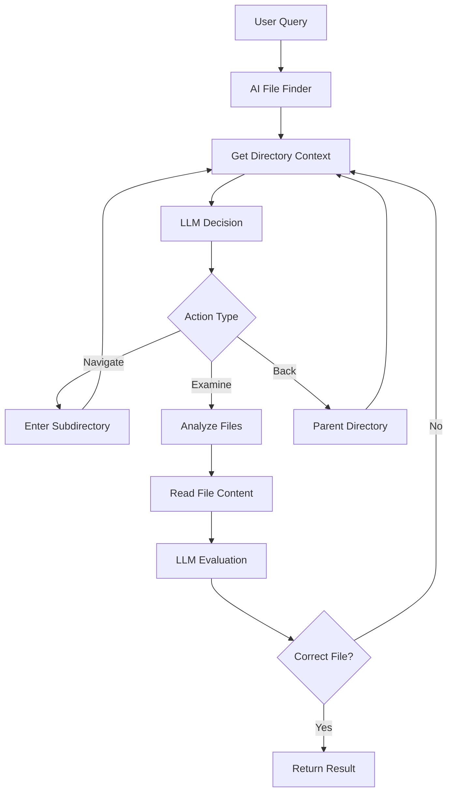

# AI-Powered File Finder System

An intelligent file finding system that uses Large Language Models (LLMs) to navigate directory structures and locate files based on natural language queries.

## 🌟 Features

### 🤖 **AI-Powered Navigation**
- Uses LLM to intelligently decide which directories to explore
- Analyzes file names, types, and content to make smart choices
- Learns from previous steps to improve decision making

### 🔍 **Natural Language Queries**
- Describe what you're looking for in plain English
- Examples: "Find a Python configuration file", "Locate CSV data with user information"
- No need to know exact file names or locations

### 🔗 **Multiple LLM Providers**
- **OpenAI** (GPT-3.5/GPT-4)
- **Anthropic** (Claude)
- **Google** (Gemini)
- **Simulation Mode** (when no API keys available)

### 📁 **Comprehensive File Support**
- Text files (Python, JavaScript, JSON, YAML, etc.)
- Data files (CSV, Excel, XML)
- Documentation (Markdown, text files)
- Configuration files (INI, YAML, JSON)

## 🚀 Quick Start

### 1. **Installation**

```bash
# Install dependencies
pip install requests pathlib

# Optional: For enhanced file support
pip install pandas openpyxl PyPDF2
```

### 2. **Setup API Keys**

Create API key files in the `api_keys/` directory:

```
api_keys/
├── openai          # Your OpenAI API key
├── claude          # Your Anthropic API key
└── gemini          # Your Google API key
```

Or set environment variables:
```bash
export OPENAI_API_KEY="your-key-here"
export ANTHROPIC_API_KEY="your-key-here"
export GOOGLE_API_KEY="your-key-here"
```

### 3. **Basic Usage**

```python
from ai_file_finder import AIFileFinder

# Initialize the finder
finder = AIFileFinder()

# Search for a file
query = "Find a Python file that contains configuration settings"
result = finder.find_file(query, start_path=".")

if result:
    file_path, content = result
    print(f"Found: {file_path}")
```

### 4. **Interactive Mode**

```bash
python ai_file_finder.py
```

## 📖 Usage Examples

### Example 1: Configuration Files
```python
finder = AIFileFinder()
result = finder.find_file(
    "Find a JSON file with application settings",
    start_path="/my/project"
)
```

### Example 2: Data Files
```python
result = finder.find_file(
    "Locate a CSV file containing user data or records",
    start_path="./data"
)
```

### Example 3: Source Code
```python
result = finder.find_file(
    "Find a Python file that handles database connections",
    start_path="./src"
)
```

## 🔧 System Architecture

### Core Components

1. **`ai_file_finder.py`** - Main AI file finder class
2. **`simple_file_browser.py`** - Directory navigation and file reading
3. **`llm_integration.py`** - LLM provider management and API calls
4. **`ai_finder_config.py`** - Configuration settings

### How It Works



### Decision Process

1. **Directory Analysis**: LLM examines available subdirectories and files
2. **Navigation Decision**: Chooses which directory to explore or files to examine
3. **File Selection**: When files are available, selects most relevant ones
4. **Content Evaluation**: Reads file content and determines if it matches the query
5. **Iteration**: Continues until the right file is found or search is exhausted

## 🎛️ Configuration

### `ai_finder_config.py` Settings

```python
# API Configuration
DEFAULT_API_PROVIDER = "openai"
MAX_SEARCH_STEPS = 20
CONFIDENCE_THRESHOLD = 0.7

# File Analysis
MAX_FILE_PREVIEW_LENGTH = 500
MAX_FILES_TO_SHOW = 10

# Behavior
FALLBACK_TO_MANUAL = True
SHOW_LLM_REASONING = True
VERBOSE_LOGGING = True
```

### LLM Provider Selection

```python
finder = AIFileFinder()

# Check available providers
providers = finder.llm_manager.get_available_providers()
print(f"Available: {providers}")

# Switch provider
finder.llm_manager.switch_provider("anthropic")
```

## 🔍 Advanced Features

### Custom Search Strategies

The AI learns from the conversation history and adapts its search strategy:

```python
# The system remembers:
# 1. Previous directories explored
# 2. Files examined but rejected
# 3. Reasoning for each decision
# 4. User feedback and corrections
```

### Manual Override

Users can take manual control at any point:

```python
# When LLM makes a decision, users can:
# - Continue with AI suggestions
# - Switch to manual file selection
# - Provide additional guidance
```

### Confidence Scoring

Each LLM decision includes a confidence score:

```python
{
    "action": "navigate",
    "choice": "src",
    "confidence": 0.8,  # High confidence
    "reasoning": "Source directory likely contains configuration files"
}
```

## 🐛 Troubleshooting

### Common Issues

1. **No API Keys Found**
   - Solution: Add API keys to `api_keys/` directory or environment variables
   - Fallback: System runs in simulation mode

2. **LLM API Errors**
   - Solution: Check API key validity and network connection
   - Fallback: Automatic fallback to simulation mode

3. **No Files Found**
   - Solution: Check starting directory and file permissions
   - Try broader or more specific queries

### Debug Mode

Enable verbose logging:

```python
# In ai_finder_config.py
VERBOSE_LOGGING = True
SHOW_LLM_REASONING = True
```

## 📁 File Structure

```
AI Architecture/
├── ai_file_finder.py              # Main AI finder
├── simple_file_browser.py         # Directory navigation
├── llm_integration.py              # LLM API handling
├── ai_finder_config.py             # Configuration
├── ai_finder_examples.py           # Usage examples
├── FILE_BROWSER_README.md          # Browser documentation
├── api_keys/                       # API key storage
│   ├── openai
│   ├── claude
│   └── gemini
└── file_browser_requirements.txt   # Dependencies
```

## 🚀 Running Examples

```bash
# Run interactive examples
python ai_finder_examples.py

# Available examples:
# 1. Basic Search
# 2. Specific File Type Search  
# 3. Data File Search
# 4. Interactive Search
# 5. Provider Management
# 6. Run All Examples
```

## 🔮 Future Enhancements

### Planned Features

- **Vector Search**: Semantic similarity matching for file content
- **Learning System**: Remember user preferences and successful patterns
- **Multi-file Analysis**: Find related files or file sets
- **Content Indexing**: Pre-index large directories for faster search
- **Plugin System**: Custom file type handlers and search strategies

### Integration Opportunities

- **VS Code Extension**: Integrate with VS Code file explorer
- **CLI Tool**: Command-line interface for scripting
- **Web Interface**: Browser-based file finder
- **API Service**: RESTful API for remote file finding

## 📄 License

This project is open source. Feel free to use, modify, and distribute.

## 🤝 Contributing

1. Fork the repository
2. Create a feature branch
3. Make your changes
4. Add tests and examples
5. Submit a pull request

## 📞 Support

For issues, questions, or feature requests:
- Check the troubleshooting section
- Review the examples
- Create an issue with detailed information about your use case
